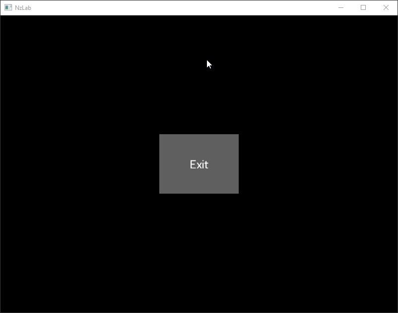

# NzLab
C++17 [Nazara Engine](https://github.com/DigitalPulseSoftware/NazaraEngine) extension for graphical user interface creation.

## Showcase
Demo | Description | Screenshot
---- | ----------- | ----------
[Sliced sprite](./examples/SlicedSprite) | One sliced sprite (top) and one non-sliced sprite (bottom) of the same image. | 
[Button](./examples/Button) | A simple button to quit application, as user **could** implement it | 

